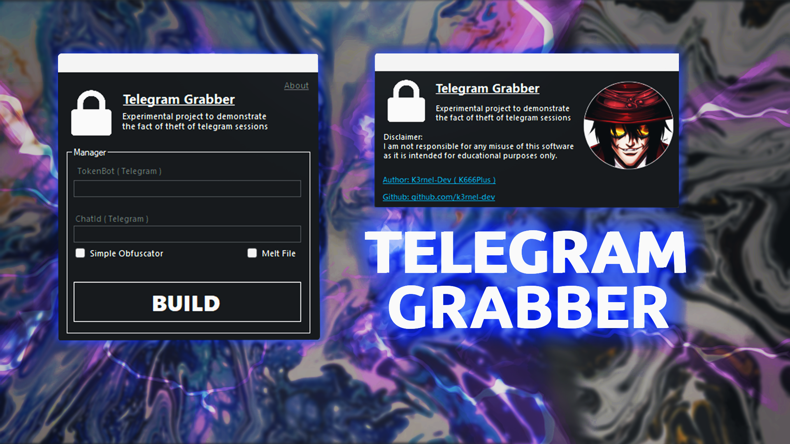
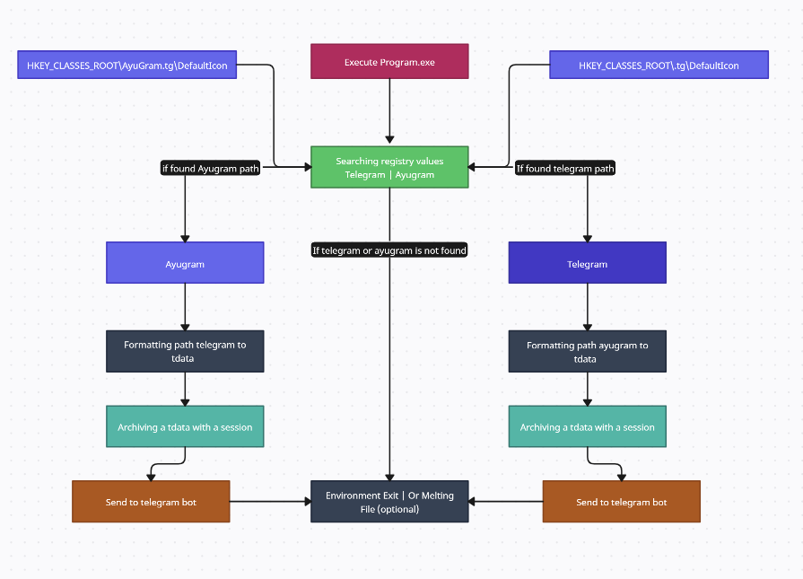

 


# 🛡️ <b>About</b> 
><b>A program demonstrating some flaws in the telegram application that allows access to other sessions without the need to enter 2fa and so on. The project has its own builder that will eventually compile a file, when launched, the actions to steal sessions will begin. The module supports the theft of sessions of 2 clients, this is the official Telegram and its modified version Ayugram.The archives themselves are sent to the telegram bot 

# 🖥️ <b>Working Graph:</b>
>


# ⚙️<b> Features</b>
- **2 client telegram supporting**: <b>Telegram / Ayugram</b>
- **Melt File**: Self-removal function after the main program work


<b>Additionally, the project includes: </b>

- **Conditional Compilation**: Only the selected features are compiled into the final build, reducing the footprint and improving performance.
- **Custom Obfuscation Engine**: Features renaming of functions, without affecting functionality.

<br>

## ⚠️  **Disclaimer**: 
```
This project is for educational purposes only, intended for studying malware and security techniques. The author is not responsible for any malicious use of this software.
```
<br>

# ⭐ Credits 
- **Author**: <a href="https://github.com/k3rnel-dev">@K3rnel-Dev</a>
- **dnlib**: A library for manipulating .NET assemblies.  
  GitHub: [https://github.com/0xd4d/dnlib](https://github.com/0xd4d/dnlib)

---